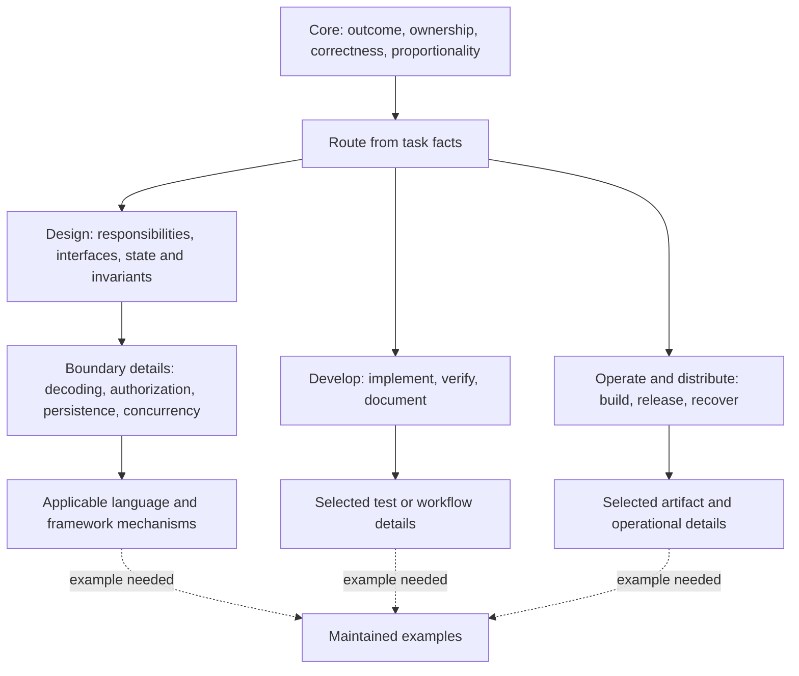

# Standards structure and guidance audit

The library has a sound foundation: explicit owners, conditional applicability,
typed relationships, and unusually careful treatment of failure, compatibility,
and evidence. It does not yet deliver efficient progression from broad design
concepts to the details needed for a task. Several important standards cannot
be selected by the executable Router, mandatory dependencies load unrelated
activities, and large documents combine independently applicable subjects.

The central content problem is uneven usefulness. Some rules explain exactly
what to do and why. Others repeatedly require a previously accepted contract,
reject nearly every default, and leave the agent to invent the decision process
that the standards should help with. Security has material missing guidance.
Some specialized requirements also have broader wording than their rationale
supports.

This is an audit and proposed direction. It changes no normative standard,
Router input, policy declaration, or active-plan status.

**Scope and method**

Audited revision: `bec1f5d93757172b537ffe1f911ececf693c6b20` on 2026-09-04.
Read all 60 documents in the canonical corpus through the Standards Engine,
using one accepted snapshot. Examined metadata relationships, executable
routing, local links, representative task routes, and the complete document
bodies. Read supporting architecture and evaluation records to distinguish
current requirements from migration intentions. Checked primary external
sources for selected recommendations; those sources are identified inline.

The [evidence file](standards-structure-and-guidance-2026-09-04.evidence.json)
retains snapshot provenance, every module's size and dependency metadata,
complete requests and results for nine route probes, and verification totals.
It is an audit observation, not an executable standards authority. Known-empty
fact sets in the probes are explicit scenario assumptions. These probes measure
the resulting reading sets; they are not downstream agent-performance trials.

| Observation | Result |
| --- | ---: |
| Canonical documents | 60 |
| Normative modules, including Core and Router | 46 |
| Non-normative reference modules | 14 |
| Words in normative modules | 57,946 |
| Words in reference modules | 10,153 |
| Normative `Requires` relationships | 137 |
| Normative `Specializes` relationships | 30 |
| Normative modules unreachable through executable routing and `Requires` closure | 4 |
| Complete verifier suites passed | 271 / 271 |
| Checks in those suites | 1,621 |

Word counts split on whitespace and include metadata, headings, tables, and
code. They are reproducible reading-load measurements, not token counts or
quality scores. The existing unrelated prototype was left untouched.

**Measured reading load**

Each selected module in these Engine responses has `whole-artifact` scope.
Shared prerequisites are counted once. Optional recipes are excluded.

| Probe and explicit assumptions | Modules | Words |
| --- | ---: | ---: |
| Core and Router only | 2 | 3,011 |
| S1 Rust library parser fix; implementation and verification | 6 | 8,932 |
| TypeScript UI label change; frontend, implementation, verification | 8 | 16,041 |
| Rust tooling and verification; no commit activity | 8 | 13,229 |
| Persisted schema implementation and verification; Contracts selected | 6 | 13,806 |
| Internal generated contract; implementation and verification; no release activity | 9 | 19,014 |
| Durable worker; planning, IPC, persistence, concurrency, resilience, diagnostics | 13 | 21,490 |
| Rust FFI; Rust API, interop, bindings, generation, implementation, verification | 18 | 28,893 |
| Uncertainty-reduction activity only | 5 | 8,875 |

The S1 set matches the Router's documented six-module example. That is a useful
success, but six documents still mean nearly nine thousand words. Verification
alone contributes 4,024 words. Module-count reduction therefore overstates the
improvement in actual reading effort.

**Prioritized findings**

High priority means the issue can omit essential guidance, misdirect a design,
or materially undermine the stated navigation objective. Medium priority means
the issue reduces clarity, proportionality, or dependable application.

**F01 — High: four Rust specializations are absent from executable routing.**

The [Rust entrypoint](../../profiles/languages/rust/README.md#rust-invariants)
directs readers to Rust Unsafe, Security, Interop, and Language Bindings.
All four are canonical, applicable profiles. However, the
[Router projection](../../evaluation/standards-effectiveness/router-projection.toml)
has neither language fact values nor target rules for them. No selected
module's transitive `Requires` edges reach them either.

The Rust FFI probe selects 18 modules with zero unresolved questions, yet omits
all four Rust-specific owners. A reader can discover them manually through
prose links, but the returned reading plan is incomplete for a task that changes
raw memory access or binding representation. This matters because the omitted
documents contain concrete checks such as raw-slice preconditions and adjacent
unsafe-operation justification.

Add observable conditions and executable selections for each specialization,
with positive and exclusion cases. Add a corpus-wide check that every normative
module is reachable through a supported route or is explicitly classified as
non-routable. Do not make all Rust work require these profiles.

**F02 — High: unconditional dependencies defeat conditional applicability.**

Two reproducible examples are:

- [Dependencies](../../topics/dependencies.md) always requires Release.
  Generated Contract requires Dependencies, so internal model generation loads
  Release's 3,320 words even when no artifact is being shipped and no published
  promise changes.
- [Tooling](../../workflows/tooling.md) always requires Commit. Selecting Rust
  tooling loads the complete history, worktree cleanup, rewrite, and hook-bypass
  workflow, although the probe contains no commit or history activity.

These dependencies may exist because particular subsections use the other
owner. That does not make the entire other activity applicable.

Reserve `Requires` for prerequisites needed whenever the source module applies.
Select release and commit work from their actual triggers. Move a genuinely
shared prerequisite into a smaller owner if conditional selection would
otherwise omit it. Audit the large fan-out in Rust API and the unconditional
Contracts dependency in TypeScript and Frontend by the same criterion.

**F03 — High: graph nodes are too coarse, and prerequisite order is not a concept hierarchy.**

The graph expresses inclusion and profile specialization. It does not provide a
complete broad-to-narrow concept map for topics and workflows. Reversing the
many edges into Core would expose a mixed list of activities, languages, and
concerns, rather than a useful next conceptual level. The S1 reading plan places
Library and Rust before Implementation and Verification; this is valid
dependency ordering but not an explicit teaching sequence.

Inside the nodes, independently applicable subjects remain bundled:

| Current node | Words / lines | Subjects that warrant conditional access |
| --- | --- | --- |
| [Contracts](../../topics/contracts.md) | 4,629 / 652 | Invariants and decoding; evolution; schema dialects; generation; equality and identity; protocol projection; persisted artifacts; degraded results |
| [Verification](../../workflows/verification.md) | 4,024 / 554 | Ordinary checks; evidence-system admission; GUI smoke; property/differential evidence; test resources; platform matrices |
| [Rust Language Bindings](../../profiles/languages/rust/language-bindings.md) | 3,402 / 489 | Value conversion; ABI; host errors; events; callback tasks; runtime ownership; executor delegation |
| [Release](../../workflows/release.md) | 3,320 / 482 | Versioning; packaging; binding generation; publication; maintenance channels; incident withdrawal |

Contracts starts with compatibility facts, then artifact/declaration/version
machinery, before reaching runtime decoding and general invariant contracts.
Architecture includes immutable replay closure in its general module-design
topic. Core spends several sections on overlapping simplicity, abstraction,
terminology, and constant-placement rules. These are concrete failures of
progressive disclosure even though metadata and links are valid.

Create short conceptual entrypoints with explicit conditional links to coherent
details. Keep necessary shared rules together; split by independently selected
decisions, not a line threshold. Use a separate navigation relationship or
derived concept view for refinement rather than misusing `Requires` as
parent-child containment. Language and application profiles should refine the
relevant concept after it has been introduced.

**F04 — Medium: precedence and requirement strength are hard to discover from the normal route.**

The [information architecture decision](../decisions/standards-library-information-architecture.md#precedence)
defines precedence, exceptions, and level semantics. Core and Router do not
give the ordinary reader that complete interpretation contract. The
[metadata schema](../../tools/standards_metadata/metadata-schema.md) is another
maintenance-side resource. Meanwhile, modules marked `MUST` contain both
preferences and categorical prohibitions.

For example, Core requires adding a defect/missing-behavior test, while
Verification permits construction proof to close a claim and requires an
admission decision before adding any permanent test. An agent must reconcile
the intention without a readily available rule explaining which provisions
are mandatory, default, conditional, or descriptive.

Put a concise normative interpretation section in the routed entrypoint. State
precedence, exception handling, and how conditional requirements and defaults
work. Clarify the test rule directly. Define unusual terms where first needed:
Architecture uses capitalized Module, Interface, Seam, Depth, Leverage, and
Locality, but the routed material does not provide a consistent glossary for
that vocabulary. Prefer ordinary terms when a special definition adds no value.

**F05 — High: rejecting defaults often removes the guidance needed to make a decision.**

Useful standards recommend an action under stated conditions and explain the
reason and exceptions. Several modules instead list candidate mechanisms and
say that every choice must come from an already accepted contract.

Examples include [TypeScript compiler configuration](../../profiles/languages/typescript.md#static-analysis-and-compiler-configuration),
which prohibits a default strict-mode bundle; [Tooling's editor configuration](../../workflows/tooling.md#editor-and-file-configuration),
which provides no default even for encoding and formatting; and substantial
parts of [Rust Tooling](../../profiles/languages/rust/tooling.md), which enumerate
tools and prerequisites while providing little choice-making guidance. The
references often repeat that their examples select nothing and must be used
only after the decision is complete.

The concern is not that every project needs the same tool. It is that an agent
starting a new module needs a sound starting point, and an agent maintaining
an existing project needs permission to rely on established, adequate
conventions without repeatedly re-justifying them.

Use a consistent compact form: **condition → recommended action → reason →
material exceptions → verification**. For example, a proposed TypeScript
default could enable `strict` for new owned code, preserve a deliberate migration
policy for existing code, and evaluate new diagnostics when upgrading the
compiler. TypeScript's documentation explains both the stronger checks and the
possibility of additional checks in future versions; the proposed default and
exception policy are this audit's recommendation.
[TypeScript documentation](https://www.typescriptlang.org/tsconfig/strict.html).

The normative corpus contains 372 occurrences of “do not,” 195 of
“unavailable,” and 366 of “selected.” These counts are editorial clues, not
defects on their own. The repeated content is visible, for example, in
[Performance](../../topics/performance.md#benchmarks-and-regression-evidence)
and its following Performance Test Evidence section: both explain claim,
workload, baseline, environment, thresholds, and weaker evidence. Consolidate
such repetitions and retain the boundary-specific nuance once.

**F06 — Medium: ordinary test work inherits an oversized evidence-admission process.**

[Verification's opening](../../workflows/verification.md#acceptance-is-a-set-of-claims)
applies a seven-part evaluation to every permanent test as well as validators,
hashes, snapshots, and other verification machinery. It asks for marginal
deciding value, alternatives, implementation/execution/review/maintenance cost,
and a retention or removal condition. Those questions are useful for a new
verification subsystem. They are excessive as an explicit decision procedure
for a straightforward regression test.

The text does not explicitly require seven separate documents. The issue is
that it fails to distinguish ordinary engineering judgment from a substantial
machinery-admission review, despite the otherwise strong proportionality rules.

Give a direct path for normal regression tests: identify the failure, assert
the observable result, and run affected checks. Apply deeper cost/overlap
analysis to expensive, duplicated, brittle, or architectural evidence systems.
Allow construction or existing tests to close a claim when they actually prove
it, and align Core's wording with that rule. Move GUI smoke and specialized
oracle guidance behind their own conditions.

**F07 — Medium: development decisions and runtime outcomes share ambiguous instructions.**

[TypeScript](../../profiles/languages/typescript.md#typed-outcomes),
[Architecture](../../topics/architecture.md#typed-outcomes), and several other
modules direct the reader to “return” `invalid`, `unsupported`, or `unavailable`
when a required design fact or evidence is missing. Some neighboring sections
use the same words for actual runtime failures. This can turn an unresolved
design choice into a new production error variant, or make an agent stop for a
routine choice it is authorized to make.

[Planning](../../workflows/planning.md#policy-projection-completeness) already
clarifies that manual processes can use prose or a table and need no serialized
diagnostic representation. That distinction should apply throughout the
library, including tasks that do not route through Planning.

Separate the instruction's subject: the developer records a missing material
decision; a tool emits a structured diagnostic where its interface requires
one; application code returns outcomes in its own domain contract. Put this
interpretation in Core and remove repeated generic outcome catalogs. Keep
specific distinctions such as an unknown commit outcome or incomplete cleanup
where they affect runtime correctness.

**F08 — High: Security lacks rules for responsibilities other owners assign to it.**

[Security](../../topics/security.md) is detailed on decoding, executable text,
listener resources, and filesystem races. It does not adequately explain
authentication, per-resource authorization, tenant isolation, secrets and
credential lifecycle, cryptographic/transport protection, or data disclosure.
These are not all universal requirements, but they need discoverable conditional
guidance when a project has those concerns.

The missing ownership is observable within the library:
[Diagnostics](../../topics/diagnostics.md#responsibility-boundaries) delegates
sensitive-data authority to Security;
[Contracts](../../topics/contracts.md#protocol-outcome-projection) delegates
disclosure; [Build](../../workflows/build.md#build-authority) delegates
supply-chain risk. Security contains no corresponding substantive disclosure
or supply-chain policy. Release does give useful publication-credential rules,
so the gap is not a complete absence of security guidance everywhere.

Start Security with the distinction between valid data, authenticated identity,
and permission to perform an action on a resource. A valid project identifier
does not prove that the current caller may read that project. Add a conditional
authorization owner covering least privilege, default denial, checks on each
protected operation, and negative cross-user/resource cases. These principles
are supported by [OWASP's Authorization Cheat Sheet](https://cheatsheetseries.owasp.org/cheatsheets/Authorization_Cheat_Sheet.html).

Add bounded guidance for sensitive fields and redaction, secret acquisition and
rotation, and dependency/build trust. Route web-specific concerns such as
output encoding and browser session protection to a web specialization instead
of making every library read a web checklist. The recommendations concern
missing standards; this audit does not claim an exploitable defect in the
repository's tooling.

**F09 — High: immutable replay rules need narrower applicability and an authorization distinction.**

[Architecture's Immutable Authority Closure](../../topics/architecture.md#immutable-authority-closure)
applies to an “immutable, replayable, or inspectable handle,” then prohibits
resolution depending on fresh authorization or unbound live filesystem/service
reads. The later qualification correctly distinguishes in-process lifetime
from cold replay, but it does not distinguish stable historical inspection from
inspection of a live resource.

A handle for viewing current job status need not promise historical replay.
An immutable report can have stable historical content while access to that
report remains subject to current permission and revocation. Historical
authorization facts used in a computation and authorization to read its result
are different responsibilities. The broad prohibition risks conflating them.

Move this to a conditional immutable-snapshot/replay subject. Bind every input
needed to reproduce the advertised historical result. Separately define the
current access check; its failure can deny disclosure without changing the
historical result. Explicitly exempt live inspection APIs from a replay promise
they do not make. Verify stable reproduction and revoked access as separate
claims. This is a wording/design risk, not a finding about current Engine access
control.

**F10 — Medium: reliability guidance needs a few concrete operational distinctions.**

[Resilience](../../topics/resilience.md#retry-and-recovery) already requires
bounded attempts/time and idempotency. Its replay section already covers
duplicate identity and resumption. [Persistence](../../profiles/boundaries/persistence.md)
already discusses atomicity, interrupted publication, and migrations. Those
foundations should be preserved. The missing detail is how agents turn them
into safe common designs.

| Decision | Existing foundation | Guidance to add when applicable |
| --- | --- | --- |
| Retrying a remote operation | Bounded retries and repeated-execution safety | End-to-end deadline versus per-attempt timeout; retry ownership across layers; backoff and jitter; service retry hints; timeout with unknown commit outcome |
| Implementing idempotency | Duplicate identity and idempotency contract | Key scope, same key with different input, retention window, and atomic recording of the operation's effect and deduplication result |
| Concurrent durable updates | Whole-invariant coordination and store guarantees | A lost-update example comparing conditional revision updates with an appropriate transaction; isolation required by the invariant; whole-transaction retry behavior |
| Time-dependent behavior | Units and timing authority are named | Distinguish elapsed duration, deadline, instant, and civil time; define clock and adjustment assumptions before comparing them |

For example, an attempt count alone does not explain how retries can amplify
load or extend user latency. AWS's guidance discusses retry-induced contention,
backoff, latency, and idempotency; use those distinctions to write a short
decision rule rather than mandate an AWS implementation.
[AWS retry guidance](https://docs.aws.amazon.com/prescriptive-guidance/latest/cloud-design-patterns/retry-backoff.html).

These additions should be small selected sections or leaves under existing
owners. They do not justify a universal distributed-systems architecture or a
new module for every possible engineering topic.

**F11 — Medium: reference and migration navigation still leak into current guidance.**

[Rust Security](../../profiles/languages/rust/security.md#panic-and-recoverable-error-boundary)
tells readers to apply the error policy at
`languages/rust/RUST-API-STANDARDS.md#result-option-panic`. That file is now a
non-normative migration index and has no such heading. This is the one missing
heading found by the audit's inline-link scan, confirmed against the target.
It contradicts the rule that current policy comes from canonical owners.

Update the reference to the actual current owner and review the referring
paragraph's semantics, rather than just changing its URL. Add anchor and
normative-to-legacy-reference coverage to relevant link checks: the existing
[Markdown link checker](../../tools/standards_verifier/README.md) explicitly
does not validate anchors.

More broadly, Rust recipes and Tooling recipes frequently describe “legacy
examples,” preserve historical product versions, and repeat extensive lists of
what the examples do not establish. Their non-normative status is clear, which
is good. Their value as current implementation help is weaker. Separate retained
migration evidence from maintained recipes and label each current recipe with
its actual preconditions, supported mechanism, and expected result. Keep one
non-authority notice rather than a second standards system of caveats.

**F12 — Medium: passing verification does not establish task-level effectiveness.**

The complete checkpoint passes all 271 suites. That supports the registered
structural and fixture assertions; it does not refute the missing Rust routes,
unnecessary reading, or the content gaps above. A sampled decision table can
prove the implementation matches its cases while omitting a required task.

The existing [scenario rescore](../archive/plans/planning-proportionality-recovery/reports/scenario-rescore.md)
is a documented human review, not a measured downstream trial. It already
acknowledges missing desktop, worker, shipped-application, and hardware
specializations. The [active plan](../plans/standards-library-effectiveness/plan.md)
also keeps two downstream pilots pending. Those limitations are appropriately
visible; this audit does not silently close them or prescribe empty profiles.

Extend evaluation with task questions whose expected standards are established
independently of the Router's current list. Measure omitted necessary guidance,
unnecessary text loaded, ability to find a finer rule, and whether an agent can
produce a defensible design from the routed material. Include a small fix, a
new module with few pre-existing contracts, a UI change, unsafe FFI, a permission
check, and a worker retry. Preserve unknown-fact behavior: the empty-facts probe
correctly reported seven unresolved categories rather than guessing.

**Proposed broad-to-narrow organization**

Retain the six document roles. They are useful applicability dimensions, not a
single sequence every task must traverse. Add a conceptual view above the
selected details. The following is a proposed navigation model, not a required
directory tree or a set of new modules to create immediately.

An agent should be able to stop at any level once it has the applicable rules.
Shared concerns can appear in several navigation paths while retaining one
canonical owner. Navigation must not automatically load every child.

Concrete restructuring candidates:

| Current owner | Keep near the broad entrypoint | Move behind explicit conditions |
| --- | --- | --- |
| Core | Outcome, ownership, honest failure, bounded changes, evidence proportionality, interpretation rules | Detailed naming/constants guidance and extended simplicity explanation |
| Architecture | Responsibility, information hiding, dependency direction, state ownership | Composed-design review procedure; immutable snapshot/replay guarantees |
| Contracts | Invariants, representation, validation boundary, consumer promises | Evolution, schema dialects, generation, identity, protocol adaptation, persisted artifacts |
| Verification | Choose a claim, write a useful check, run affected evidence, report limits | Evidence-system admission, advanced oracles, GUI smoke, target matrices |
| Security | Trust, identity, authorization, least authority, sensitive data | Filesystem containment, command encoding, network resource controls, web mechanisms |
| Rust bindings | Representation and conversion obligations | Host events, callback tasks, runtime adaptation, executor delegation |
| Commit | Ordinary staging, verification, and commit meaning | Rewrite, integration topology, worktree retirement, emergency bypass |

Move registered policy units with their identity, consumers, and verification
through the Engine. Do not replace a large authoritative file with a large
mandatory dependency bundle that has the same reading cost.

**Examples of clearer guidance**

These are editorial proposals, not applied standards.

For abstraction design:

> Keep behavior together when it shares invariants and changes for the same
> reasons. Introduce a boundary when it hides a separately changing decision or
> enforces an invariant. Compare representative caller changes before and after;
> callers should need less unrelated knowledge. Add reuse machinery only for a
> current need.

For missing information:

> Establish facts that can change correctness, authority, compatibility, or
> acceptance. If a material fact is missing, record the unresolved decision and
> continue independent work. Choose reversible implementation details using
> applicable defaults and existing conventions. Runtime errors follow the
> application's own contract.

For ordinary verification:

> Add a regression check for the behavior that failed, unless an existing check
> or construction guarantee already proves it. Assert the observable outcome
> and run checks for affected boundaries. Use the evidence-system review when
> adding costly or overlapping verification machinery.

A worked example should then show the actual decision: for instance, why an
internal parser remains one module while a storage adapter hides transaction
and resource lifetime details. An example that merely substitutes
`selected_contract()` for every difficult choice does not supply that help.

**Recommended repair order and acceptance**

1. Repair the four missing Rust routes and the stale canonical-policy link.
   Acceptance: positive/exclusion scenarios and complete routability coverage.
2. Correct unconditional Release and Commit inclusion. Acceptance: internal
   generation and tooling-only probes omit those activities while actual
   publication and history work retain them.
3. Fill the authorization/disclosure gap and narrow replay/access wording.
   Acceptance: concrete cross-user access and revoked-report-access design cases
   have clear owners and unambiguous guidance.
4. Split the largest independent subjects and shorten Core and Verification's
   ordinary path. Acceptance: representative task reading falls materially
   without omitting a rule needed for the task.
5. Clarify process versus runtime instructions, add useful conditional defaults,
   and consolidate repetition. Acceptance: a small fix and a new-module task
   produce a defensible action without unnecessary approvals or evidence
   machinery.
6. Run the already planned downstream pilots and rescore against independent
   task expectations. Decide missing optional profiles from those results.

Preserve the library's strongest existing guidance during these changes:
coherent ownership over file-count rules; real consumers over speculative
compatibility; validated values over type assertions; cancellation and failure
ownership; generated freshness distinct from semantic correctness; and evidence
matched to the actual claim. The desired result is less reading with more
usable design guidance, not brevity achieved by deleting important nuance.
